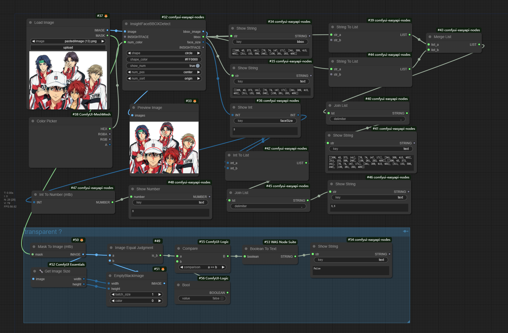
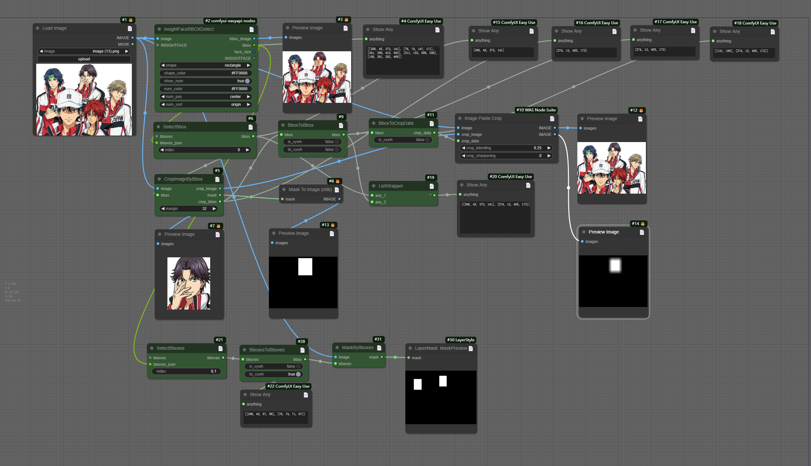
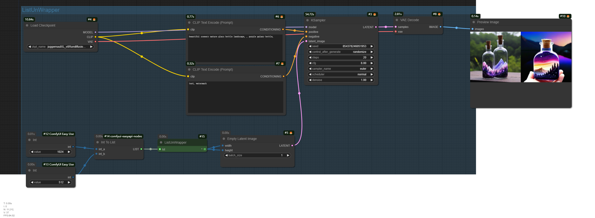
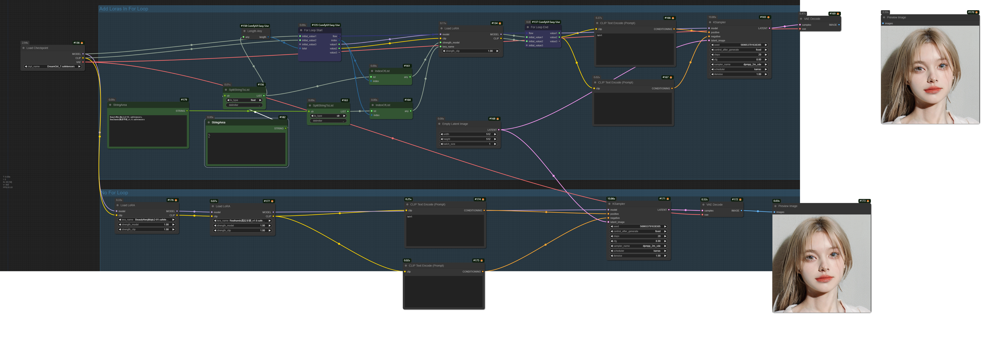
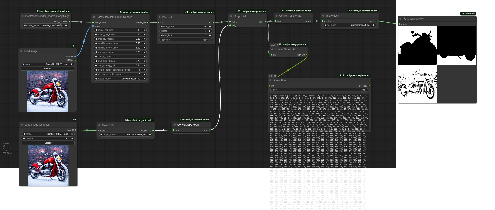
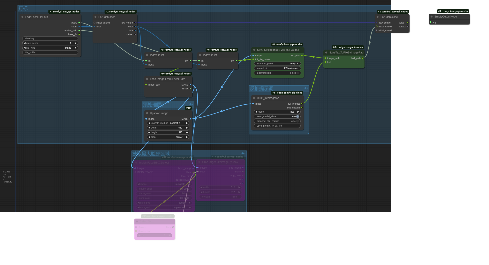
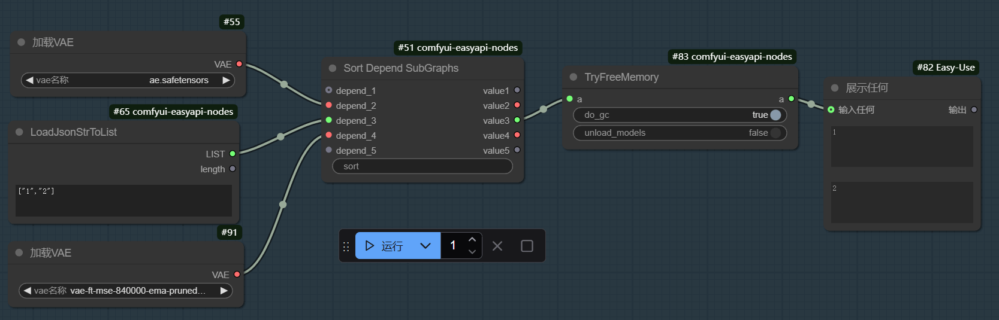
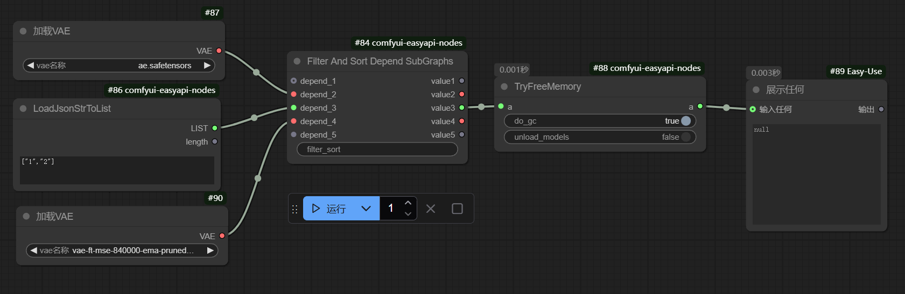
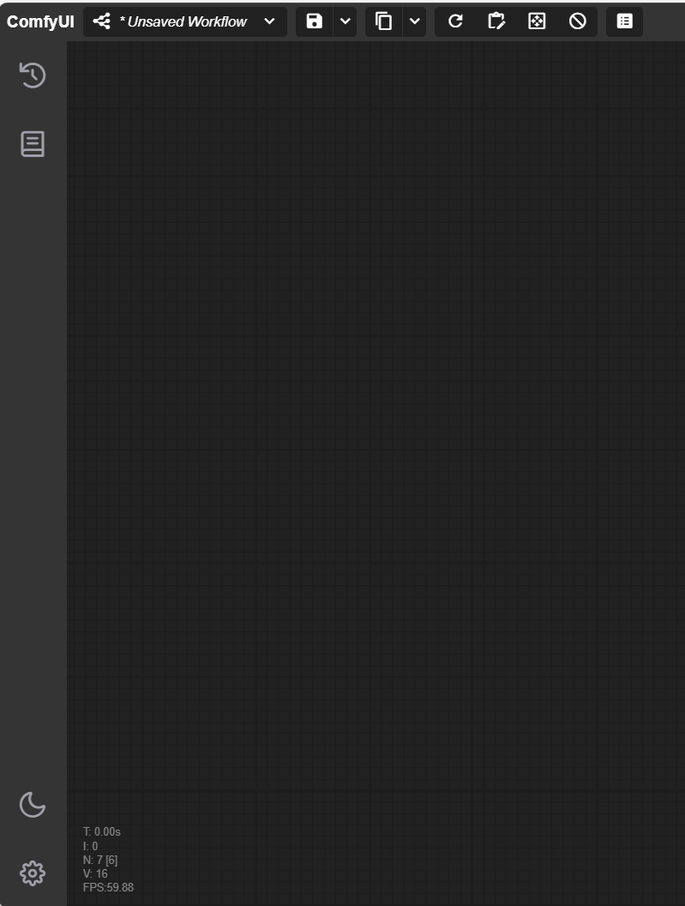
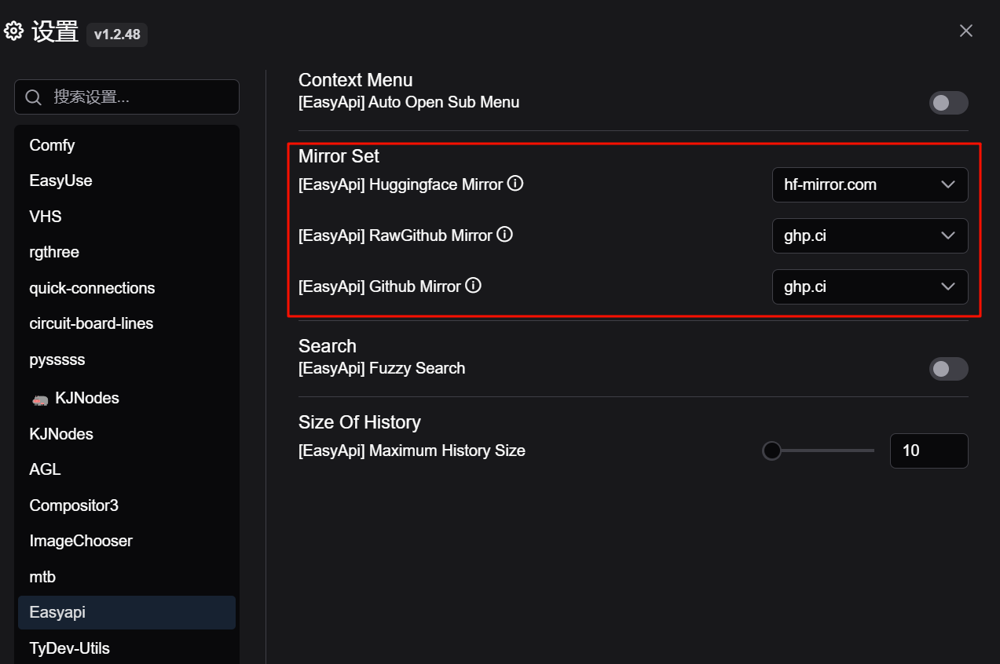

# comfyui-easyapi-nodes
针对api接口开发补充的一些自定义节点和功能。

转成base64的节点都是输出节点，websocket消息中会包含base64Images和base64Type属性（具体格式请查看ImageNode.py中的ImageToBase64Advanced类源代码，或者自己搭建简单流程运行在浏览器开发者工具-->网络中查看）

Tips: base64格式字符串比较长，会导致界面卡顿，接口请求带宽可能也会有瓶颈，条件允许可以把图片上传到OSS服务器得到URL，然后用LoadImageFromURL加载，由于无相关OSS账号，上传OSS节点需自行编写，暂不支持。

## 安装
- 方式1：通过ComfyUI-Manager安装
- 方式2：在ComfyUI安装目录根目录下打开命令行终端，执行以下命令
  ```sh
  cd custom_nodes
  git clone https://github.com/lldacing/comfyui-easyapi-nodes.git
  cd comfyui-easyapi-nodes
  pip install -r requirements.txt
  ```
## 升级
- 在ComfyUI安装目录根目录下打开命令行终端，执行以下命令
  ```sh
  cd custom_nodes/comfyui-easyapi-nodes
  git pull
  ```

## 节点
|  是否为输出节点   | 名称                           | 说明                                                                                                                                                             |
|:----------:|------------------------------|----------------------------------------------------------------------------------------------------------------------------------------------------------------|
|     ×      | LoadImageFromURL             | 从网络地址加载图片，一行代表一个图片                                                                                                                                             |
|     ×      | LoadMaskFromURL              | 从网络地址加载遮罩，一行代表一个                                                                                                                                               |
|     ×      | Base64ToImage                | 把图片base64字符串转成图片                                                                                                                                               |
|     ×      | Base64ToMask                 | 把遮罩图片base64字符串转成遮罩                                                                                                                                             |
|     ×      | ImageToBase64Advanced        | 把图片转成base64字符串, 可以选择图片类型(image, mask) ，方便接口调用判断                                                                                                                |
|     ×      | ImageToBase64                | 把图片转成base64字符串(imageType=["image"])                                                                                                                            |
|     √      | MaskToBase64Image            | 把遮罩转成对应图片的base64字符串(imageType=["mask"])                                                                                                                        |
|     √      | MaskImageToBase64            | 把遮罩图片转成base64字符串(imageType=["mask"])                                                                                                                           |
|     ×      | LoadImageToBase64            | 加载本地图片转成base64字符串                                                                                                                                              |
|     √      | SamAutoMaskSEGS              | 得到图片所有语义分割的coco_rle或uncompress_rle格式。<br/>配合ComfyUI-Impact-Pack的SAMLoader或comfyui_segment_anything的SAMModelLoader。<br/>但是如果使用hq模型，必须使用comfyui_segment_anything |
|     ×      | SamAutoMaskSEGSAdvanced      | 得到图片所有语义分割的coco_rle或uncompress_rle格式。可以调整sam的参数。                                                                                                               |
|     ×      | MaskToRle                    | 遮罩图转为coco_rle或uncompress_rle格式，rle格式数据只保存二值，所以无法精准还原遮罩                                                                                                         |
|     ×      | RleToMask                    | coco_rle或uncompress_rle格式转为遮罩，rle格式数据只保存二值，所以无法精准还原遮罩                                                                                                          |
|     ×      | InsightFaceBBOXDetect        | 为图片中的人脸添加序号和区域框                                                                                                                                                |
|     ×      | ColorPicker                  | 颜色选择器                                                                                                                                                          |
|     ×      | IntToNumber                  | 整型转数字                                                                                                                                                          |
|     ×      | StringToList                 | 字符串转列表                                                                                                                                                         |
|     ×      | IntToList                    | 整型转列表                                                                                                                                                          |
|     ×      | ListMerge                    | 列表合并                                                                                                                                                           |
|     ×      | JoinList                     | 列表根据指定分隔符连接（会先把列表元素转成字符串）                                                                                                                                      |
|     √      | ShowString                   | 显示字符串(可指定消息中key值)                                                                                                                                              |
|     √      | ShowInt                      | 显示整型(可指定消息中key值)                                                                                                                                               |
|     √      | ShowFloat                    | 显示浮点型(可指定消息中key值)                                                                                                                                              |
|     √      | ShowNumber                   | 显示数字(可指定消息中key值)                                                                                                                                               |
|     √      | ShowBoolean                  | 显示布尔值(可指定消息中key值)                                                                                                                                              |
|     ×      | ImageEqual                   | 图片是否相等（可用于通过判断遮罩图是否全黑来判定是否有遮罩）                                                                                                                                 |
|     ×      | SDBaseVerNumber              | 判断SD大模型版本是1.5还是xl                                                                                                                                              |
|     ×      | ListWrapper                  | 包装成列表（任意类型）                                                                                                                                                    |
|     ×      | ListUnWrapper                | 转成输出列表，后面连接的节点会把每个元素执行一遍，实现类似遍历效果                                                                                                                              |
|     ×      | BboxToCropData               | bbox转cropData，方便接入was插件节点使用                                                                                                                                    |
|     ×      | BboxToBbox                   | bbox两种格式(x,y,w,h)和(x1,y1,x2,y2)的相互转换                                                                                                                           |
|     ×      | BboxesToBboxes               | BboxToBbox节点的列表版本                                                                                                                                              |
|     ×      | SelectBbox                   | 从Bbox列表中选择一个                                                                                                                                                   |
|     ×      | SelectBboxes                 | 从Bbox列表中选择多个                                                                                                                                                   |
|     ×      | CropImageByBbox              | 根据Bbox区域裁剪图片                                                                                                                                                   |
|     ×      | MaskByBboxes                 | 根据Bbox列表画遮罩                                                                                                                                                    |
|     ×      | SplitStringToList            | 根据分隔符把字符串拆分为某种数据类型(str/int/float/bool)的列表                                                                                                                      |
|     ×      | IndexOfList                  | 从列表中获取指定位置的元素                                                                                                                                                  |
|     ×      | IndexesOfList                | 从列表中筛选出指定位置的元素列表                                                                                                                                               |
|     ×      | StringArea                   | 字符串文本框（多行输入区域）                                                                                                                                                 |
|     ×      | ForEachOpen                  | 循环开始节点                                                                                                                                                         |
|     ×      | ForEachClose                 | 循环结束节点                                                                                                                                                         |
|     ×      | LoadJsonStrToList            | json字符串转换为对象列表                                                                                                                                                 |
|     ×      | ConvertTypeToAny             | 转换数据类型为任意类型，桥接实际具有相同数据类型参数的两节点                                                                                                                                 |
|     ×      | GetValueFromJsonObj          | 从对象中获取指定key的值                                                                                                                                                  |
|     ×      | FilterValueForList           | 根据指定值过滤列表中元素                                                                                                                                                   |
|     ×      | SliceList                    | 列表切片                                                                                                                                                           |
|     ×      | LoadLocalFilePath            | 列出给定路径下的文件列表                                                                                                                                                   |
|     ×      | LoadImageFromLocalPath       | 根据图片全路径加载图片                                                                                                                                                    |
|     ×      | LoadMaskFromLocalPath        | 根据遮罩全路径加载遮罩                                                                                                                                                    |
|     ×      | IsNoneOrEmpty                | 判断是否为空或空字符串或空列表或空字典                                                                                                                                            |
|     ×      | IsNoneOrEmptyOptional        | 为空时返回指定值(惰性求值)，否则返回原值。                                                                                                                                         |
|     √      | EmptyOutputNode              | 空的输出类型节点                                                                                                                                                       |
|     ×      | SaveTextToFileByImagePath    | 保存文本到图片路径，以图片名作为文件名                                                                                                                                            |
|     ×      | CopyAndRenameFiles           | 把某个目录下的文件复制到另一个目录并重命名，若目标目录为空值，则重命名原文件                                                                                                                         |
|     ×      | SaveImagesWithoutOutput      | 保存图像到指定目录，不是输出类型节点，可用于循环批量跑图和作为惰性求值的前置节点                                                                                                                       |
|     ×      | SaveSingleImageWithoutOutput | 保存单个图像到指定目录，不是输出类型节点，可用于循环批量跑图和作为惰性求值的前置节点                                                                                                                     |
|     ×      | CropTargetSizeImageByBbox    | 以bbox区域中心向外裁剪指定宽高图片                                                                                                                                            |
|     ×      | ConvertToJsonStr             | 序列化为json字符串                                                                                                                                                    |
|     ×      | SaveTextToLocalFile          | 保存文本到本地文件                                                                                                                                                      |
|     ×      | ReadTextFromLocalFile        | 从本地文件读取文本                                                                                                                                                      |
|     ×      | TryFreeMemory                | 回收内（显）存                                                                                                                                                        |
|     ×      | IfElseForEmptyObject         | 可以对list类型进行判断                                                                                                                                                  |
|     ×      | ImageSizeGetter              | 获取图片尺寸（宽、高、最大边、最小边、批次）                                                                                                                                         |
|     ×      | FilterSortDependSubGraphs    | 使前置依赖子图按指定顺序执行（且只执行配置的前置依赖），如：配置filter_sort为1,4,3 表示按 depend_1 => depend_4 => depend_3 依次执行, 而depend_2不会被执行。                                                   |
|     ×      | SortDependSubGraphs          | 使前置依赖子图按指定顺序执行（未配置的依赖输入项在指定项后按默认顺序执行），如：配置sort为1,4 表示先按 depend_1 => depend_4 依次执行, 然后depend_3和depend_2按默认顺序执行。                                                 |
|     ×      | NoneNode                     | 返回None                                                                                                                                                         |

### 示例
  
### [工作流](example)
  
  
  
  
  
  
  

## 更新记录
### 2025-03-28 (v1.1.4)
- 新增节点 NoneNode
### 2025-03-28 (v1.1.3)
- 新增配置项 `allow_create_dir_when_save` 控制保存文本和图像时是否自动创建目录
- 新增节点 ImageSizeGetter、FilterSortDependSubGraphs、SortDependSubGraphs
  
  
### 2025-02-19 (v1.1.1)
- 新增节点：IsNoneOrEmptyOptional
### 2024-12-01 (v1.1.0)
- 新增节点：SaveTextToLocalFile、 ReadTextFromLocalFile

### 2024-11-04 (v1.0.9)
- 新增节点：SamAutoMaskSEGSAdvanced、 MaskToRle、 RleToMask、 ConvertToJsonStr

### 2024-10-24 (v1.0.7)
- 新增节点：SaveTextToFileByImagePath、 CopyAndRenameFiles、 SaveImagesWithoutOutput、 SaveSingleImageWithoutOutput、 CropTargetSizeImageByBbox

### 2024-10-18
- 新增节点：SliceList、LoadLocalFilePath、LoadImageFromLocalPath、LoadMaskFromLocalPath、IsNoneOrEmpty、IsNoneOrEmptyOptional、EmptyOutputNode

### 2024-09-29
- 新增节点：FilterValueForList

### 2024-09-26
- 新增节点：GetValueFromJsonObj、 LoadJsonStrToList、ConvertTypeToAny 

### 2024-09-25 [示例](example/example_4.png)
- 新增节点：ForEachOpen、 ForEachClose 

### 2024-09-20 [示例](example/example_4.png)
- 添加节点：SplitStringToList、 IndexOfList、 IndexesOfList、 StringArea

### 2024-09-19
- 添加ListUnWrapper节点

### 2024-09-04
- 添加一些bbox相关节点

### 2024-08-08
- 菜单适配ComfyUI前端新界面

  

## 功能
- 扩展Save(Api Format)菜单。
   - 复制工作流
   - 复制/保存api格式工作流(需打开配置Settings->Enable Dev mode Options)
     - Save as / Copy Api
       
       保存/复制api格式workflow
     - Copy EasyAi as / Copy EasyAi
       
       保存/复制api格式workflow。把LoadImage替换成Base64ToImage节点，把PreviewImage和SaveImage替换成ImageToBase64节点

  
- Settings配置扩展

  
  - 保留历史记录最大条数

    配置路径：Settings -> [EasyApi] Maximum History Size

    Tips: 图片使用base64时，数据存在内存中，默认最大历史记录条数是10000，为防止内存溢出，所以新增此配置项。

  - 是否自动展开当前菜单下的子菜单
    配置路径：Settings -> [EasyApi] Auto Open Sub Menu
  
    
  - 模糊搜索
    配置路径：Settings -> [EasyApi] Fuzzy Search  
    
  - 使用镜像地址(模型自动下载问题)
    - 配置路径：Settings -> [EasyApi] Huggingface Mirror  
    - 配置路径：Settings -> [EasyApi] RawGithub Mirror  
    - 配置路径：Settings -> [EasyApi] Github Mirror  
    
    
- 菜单扩展
  - 重设某个节点的id(Node Context Menu)
  
    
  - 从序号1开始重新设置所有节点的id(Canvas Context Menu)
  
    
  - 定位到与当前节点有连接线的节点(Node Context Menu)
  
    