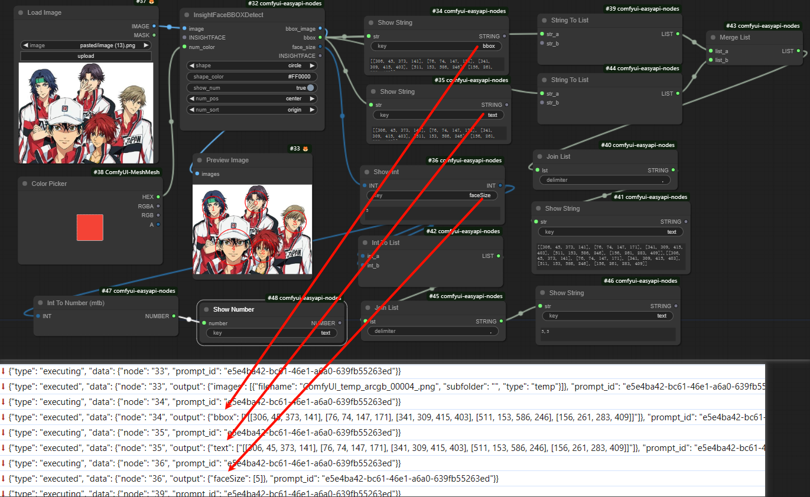
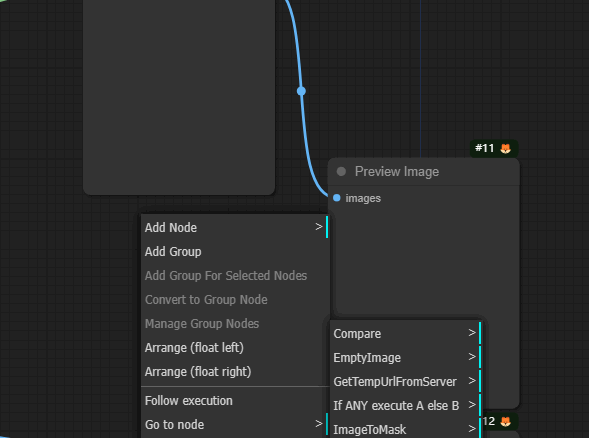
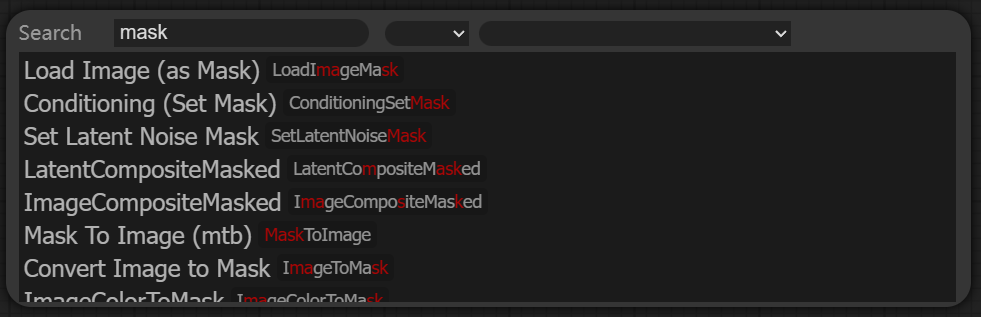
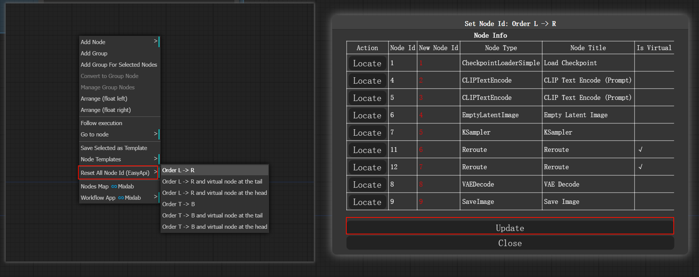
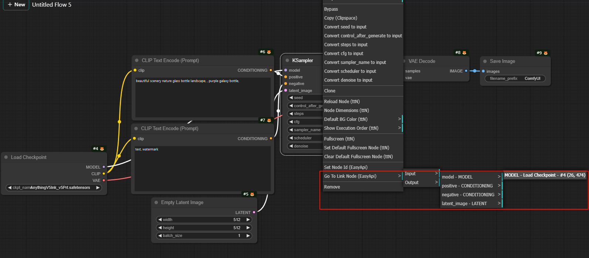

# comfyui-easyapi-nodes
针对api接口开发补充的一些自定义节点和功能。

转成base64的节点都是输出节点，websocket消息中会包含base64Images和base64Type属性（具体格式请查看ImageNode.py中的ImageToBase64Advanced类源代码，或者自己搭建简单流程运行在浏览器开发者工具-->网络中查看）
## 安装
- 方式1：通过ComfyUI-Manager安装
- 方式2：在ComfyUI安装目录根目录下打开命令行终端，执行以下命令
  ```sh
  cd custom_nodes
  git clone https://github.com/lldacing/comfyui-easyapi-nodes.git
  cd comfyui-easyapi-nodes
  pip install -r requirements.txt
  ```
## 升级
- 在ComfyUI安装目录根目录下打开命令行终端，执行以下命令
  ```sh
  cd custom_nodes/comfyui-easyapi-nodes
  git pull
  ```

## 节点
| 名称                    | 说明                                                                                                                                                         |
|-----------------------|------------------------------------------------------------------------------------------------------------------------------------------------------------|
| LoadImageFromURL      | 从网络地址加载图片，一行代表一个图片                                                                                                                                         |
| LoadMaskFromURL       | 从网络地址加载遮罩，一行代表一个                                                                                                                                           |
| Base64ToImage         | 把图片base64字符串转成图片                                                                                                                                           |
| Base64ToMask          | 把遮罩图片base64字符串转成遮罩                                                                                                                                         |
| ImageToBase64Advanced | 把图片转成base64字符串, 可以选择图片类型(image, mask) ，方便接口调用判断                                                                                                            |
| ImageToBase64         | 把图片转成base64字符串(imageType=["image"])                                                                                                                        |
| MaskToBase64Image     | 把遮罩转成对应图片的base64字符串(imageType=["mask"])                                                                                                                    |
| MaskImageToBase64     | 把遮罩图片转成base64字符串(imageType=["mask"])                                                                                                                       |
| LoadImageToBase64     | 加载本地图片转成base64字符串                                                                                                                                          |
| SamAutoMaskSEGS       | 得到图片所有语义分割的coco或uncompress_rle格式。<br/>配合ComfyUI-Impact-Pack的SAMLoader或comfyui_segment_anything的SAMModelLoader。<br/>但是如果使用hq模型，必须使用comfyui_segment_anything |
| InsightFaceBBOXDetect | 为图片中的人脸添加序号和区域框                                                                                                                                            |
| ColorPicker           | 颜色选择器                                                                                                                                                      |
| IntToNumber           | 整型转数字                                                                                                                                                      |
| StringToList          | 字符串转列表                                                                                                                                                     |
| IntToList             | 整型转列表                                                                                                                                                      |
| ListMerge             | 列表合并                                                                                                                                                       |
| JoinList              | 列表根据指定分隔符连接                                                                                                                                                |
| ShowString            | 显示字符串(可指定消息中key值)                                                                                                                                          |
| ShowInt               | 显示整型(可指定消息中key值)                                                                                                                                           |
| ShowFloat             | 显示浮点型(可指定消息中key值)                                                                                                                                          |
| ShowNumber            | 显示数字(可指定消息中key值)                                                                                                                                           |

Tips: base64格式字符串比较长，会导致界面卡顿，接口请求带宽可能也会有瓶颈，条件允许可以把图片上传到OSS服务器得到URL，然后用LoadImageFromUrl加载，由于无相关OSS账号，上传OSS节点需自行编写，暂不支持。

### [示例](example/example.png)
  

## 功能
- 扩展Save(Api Format)菜单。
   - 复制工作流
   - 复制/保存api格式工作流(需打开配置Settings->Enable Dev mode Options)
     - Save as / Copy Api
       
       保存/复制api格式workflow
     - Copy EasyAi as / Copy EasyAi
       
       保存/复制api格式workflow。把LoadImage替换成Base64ToImage节点，把PreviewImage和SaveImage替换成ImageToBase64节点

  
- Settings配置扩展

  
  - 保留历史记录最大条数

    配置路径：Settings -> [EasyApi] Maximum History Size

    Tips: 图片使用base64时，数据存在内存中，默认最大历史记录条数是10000，为防止内存溢出，所以新增此配置项。

  - 是否自动展开当前菜单下的子菜单
    配置路径：Settings -> [EasyApi] Auto Open Sub Menu
  
    
  - 模糊搜索
    配置路径：Settings -> [EasyApi] Fuzzy Search  
    
  - 使用镜像地址(模型自动下载问题)
    - 配置路径：Settings -> [EasyApi] Huggingface Mirror  
    - 配置路径：Settings -> [EasyApi] RawGithub Mirror  
    
    
- 菜单扩展
  - 重设某个节点的id(Node Context Menu)
  
    
  - 从序号1开始重新设置所有节点的id(Canvas Context Menu)
  
    
  - 定位到与当前节点有连接线的节点(Node Context Menu)
  
    