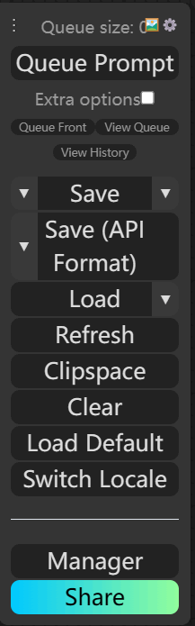

# comfyui-easyapi-nodes
针对api接口开发补充的一些自定义节点和功能。

转成base64的节点都是输出节点，websocket消息中会包含base64Images和base64Type属性（具体格式请查看ImageNode.py中的ImageToBase64Advanced类源代码，或者自己搭建简单流程运行在浏览器开发者工具-->网络中查看）

## 节点
| 名称                    | 说明                                                                                                                                                         |
|-----------------------|------------------------------------------------------------------------------------------------------------------------------------------------------------|
| Base64ToImage         | 把图片base64字符串转成图片                                                                                                                                           |
| ImageToBase64Advanced | 把图片转成base64字符串, 可以选择图片类型(image, mask) ，方便接口调用判断                                                                                                            |
| ImageToBase64         | 把图片转成base64字符串(imageType=["image"])                                                                                                                        |
| MaskToBase64Image     | 把遮罩转成对应图片的base64字符串(imageType=["mask"])                                                                                                                    |
| MaskImageToBase64     | 把遮罩图片转成base64字符串(imageType=["mask"])                                                                                                                       |
| LoadImageToBase64     | 加载本地图片转成base64字符串                                                                                                                                          |
| SamAutoMaskSEGS       | 得到图片所有语义分割的coco或uncompress_rle格式。 配合ComfyUI-Impact-Pack的SAMLoader或comfyui_segment_anything的SAMModelLoader。 但是如果使用hq模型，必须使用comfyui_segment_anything |

## 功能
- 扩展Save(Api Format)菜单。

   支持保存api格式workflow时，把LoadImage替换成Base64ToImage节点，把PreviewImage和SaveImage替换成ImageToBase64节点

  
- Setting中支持历史记录最大条数修改

  图片使用base64时，数据存在内存中，默认最大历史记录条数是10000，为防止内存溢出，所以新增此配置项。

  配置路径：Setting -> Maximum History Size
